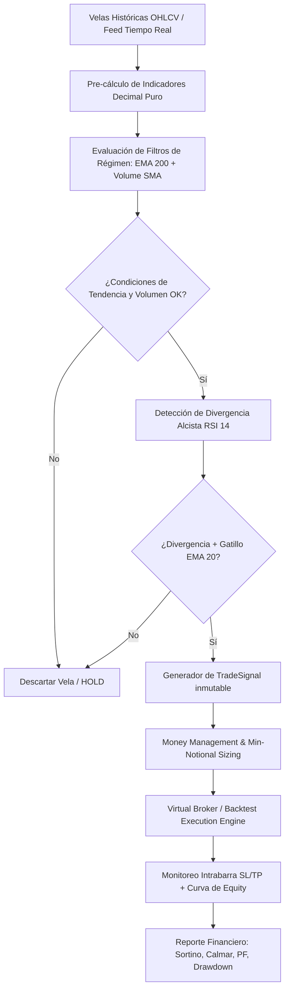
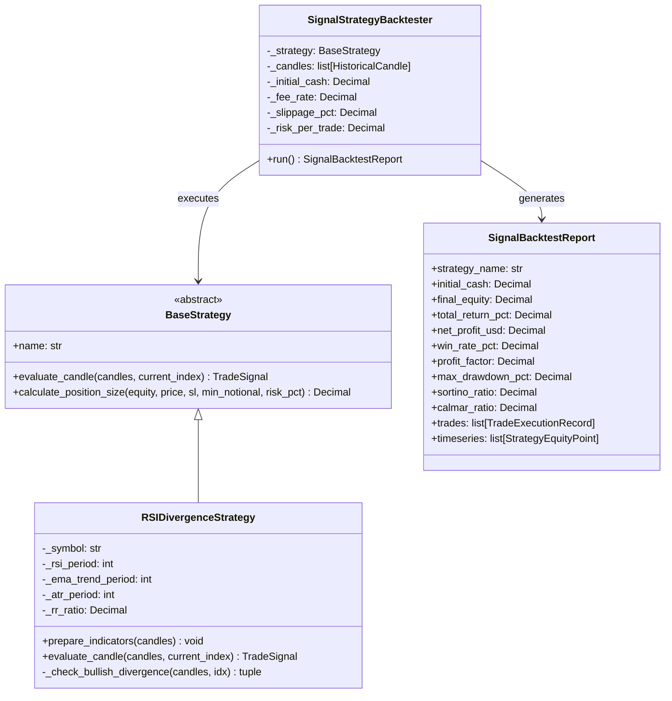

# Módulo 9: Estrategias Cuantitativas, Motor de Backtesting de Señales y Paper Trading ($25 USD)

**Proyecto:** Chimuelo Prime — Algorithmic & Quantitative Trading System  
**Documento:** `documentado/M9_QUANTITATIVE_STRATEGIES_AND_BACKTESTING.md`  
**Autoría:** Director de Documentación Técnica y Auditoría de Calidad (AGENTERS A00, A06, A11)  
**Versión:** 1.0.0  
**Fecha de Publicación:** 22 de Agosto de 2026  
**Estado:** ✅ Operativo / Production-Ready  

---

## 1. Resumen Ejecutivo y Objetivo Financiero

El **Módulo 9 (M9)** de Chimuelo Prime formaliza la infraestructura de **Estrategias Cuantitativas Direccionales**, el **Motor de Simulación Event-Driven para Señales** y el entorno de **Paper Trading / Virtual Broker**, diseñado específicamente para maximizar la tasa de crecimiento de capital en micro-cuentas con restricciones severas de balance.



### 1.1 Objetivo Financiero Cuantitativo

| Métrica | Objetivo Operativo | Justificación Matemática |
| :--- | :--- | :--- |
| **Capital Base Inicial** | **$25.00 USDT** | Tamaño de micro-cuenta estándar para validación experimental. |
| **Objetivo de Beneficio Neto** | **+$5.00 USDT Netos** | Crecimiento neto tras deducir fees y slippage de entrada/salida. |
| **Retorno sobre Capital (ROI)** | **+20.00%** | $\Delta Equity = \frac{30.00 - 25.00}{25.00} = +20.00\%$. |
| **Horizonte Temporal** | **$\le$ 30 Días Calendario** | Operativa de swing / intraday en temporalidades 15m / 1h / 4h. |
| **Max Drawdown Permitido** | **$\le$ 8.00% ($2.00 USD)** | Límite infranqueable de pérdida de capital (Circuit Breaker). |
| **Profit Factor Mínimo** | **$\ge$ 1.80** | Ratio bruto de ganancias contra pérdidas acumuladas. |
| **Ratio Riesgo:Beneficio (R:R)** | **1 : 2.50** | Asimetría positiva: ganar $2.50 por cada $1.00 arriesgado. |

> [!IMPORTANT]
> **El Desafío del Min Notional ($5.00 USDT) en Cuentas de $25.00 USD:**  
> En Binance Spot, cada orden requiere un `MIN_NOTIONAL` de al menos $5.00 USDT. Con un capital de $25.00 USD, una orden de $5.00 USD representa el 20% del patrimonio total asignado en margen nominal. Por ello, el control de riesgo no se calcula sobre el nocional total expuesto, sino sobre la **distancia real de corte de pérdida (Stop Loss)** multiplicado por la cantidad adquirida ($Riesgo = Qty \times \Delta P_{SL}$).

---

## 2. Formulación Matemática de la Estrategia

La estrategia insignia implementada es la **RSI Divergence + EMA 200 Macro Trend Filter + Volume Breakout + Dynamic ATR Risk Manager**.

```
                         [ PRECIO ]
          /\                                 /\
         /  \                               /  \
        /    \    /\                       /    \
       /      \  /  \                     /      \
      /        \/    \                   /        \
                      \                 /
                       \   /\          /
                        \ /  \  <--- Mínimo más bajo (Lower Low / Double Bottom)
                         v    \  /
                               \/
───────────────────────────────────────────────────────────── [ EMA 200 Trend Line ]
                         [ RSI ]
          /\
         /  \             /\
        /    \           /  \            /\  <--- Mínimo más alto (Higher Low)
       /      \  /\     /    \          /  \      (DIVERGENCIA ALCISTA)
      /        \/  \   /      \  /\    /    \
                    \_/        \/  \  /
                                    \/
```

### 2.1 Componentes e Indicadores Matemáticos

Todos los indicadores han sido implementados en [`chimuelo_prime/strategies/indicators.py`](file:///c:/Users/merid/Downloads/chim/chimuelo_prime/strategies/indicators.py) utilizando aritmética determinista `Decimal` para evitar errores de coma flotante IEEE 754.

#### 1. Filtro de Tendencia Macro (EMA 200)
Garantiza que sólo se abran posiciones largas a favor de la tendencia estructural:
$$\text{EMA}_t(P, k) = P_t \cdot \alpha + \text{EMA}_{t-1} \cdot (1 - \alpha)$$
Donde el multiplicador de ponderación $\alpha$ es:
$$\alpha = \frac{2}{k + 1}, \quad k = 200 \implies \alpha = \frac{2}{201} \approx 0.00995025$$
**Condición de Entrada:**
$$Close_t > \text{EMA}_{200}(Close)_t$$

#### 2. Filtro de Volumen y Liquidez (Volume SMA 20)
Verifica que la vela de confirmación cuente con interés institucional y volumen superior al promedio móvil simple:
$$\text{SMA}_{20}(V)_t = \frac{1}{20} \sum_{i=0}^{19} V_{t-i}$$
**Condición de Entrada:**
$$V_t \ge \text{SMA}_{20}(V)_t \times 1.10$$

#### 3. Oscilador RSI con Suavizado de Wilder (RSI 14)
El Relative Strength Index de Wilder calcula el momentum relativo de subidas y bajadas:
$$U_t = \max(Close_t - Close_{t-1}, 0), \quad D_t = \max(Close_{t-1} - Close_t, 0)$$
Promedios suavizados de Wilder:
$$\overline{U}_t = \frac{\overline{U}_{t-1} \cdot 13 + U_t}{14}, \quad \overline{D}_t = \frac{\overline{D}_{t-1} \cdot 13 + D_t}{14}$$
$$RS_t = \frac{\overline{U}_t}{\overline{D}_t} \implies \text{RSI}_t = 100 - \left( \frac{100}{1 + RS_t} \right)$$

#### 4. Algoritmo de Detección de Divergencia Alcista Regular
Se inspecciona una ventana de lookback retrospectiva de $L = 25$ velas hacia atrás:
1. Se identifica un mínimo local previo $j \in [t - L, t - 4]$ donde $\text{RSI}_j \le 38.0$ (zona de sobreventa/tensión vendedora).
2. El mínimo actual en precio $Low_t$ es inferior o equivalente al precio anterior:
   $$Low_t \le Low_j \times 1.005$$
3. El valor actual del RSI es estrictamente superior al RSI anterior por al menos 2.0 puntos (pérdida de inercia bajista):
   $$\text{RSI}_t \ge \text{RSI}_j + 2.0$$
4. El RSI reciente se ubica en zona de activación ($\min_{i \in [t-2, t]} \text{RSI}_i \le 45.0$).

#### 5. Gatillo de Confirmación y Momentum Inmediato (EMA 20)
Para evitar entrar antes de que el precio gire, se exige una vela verde con cierre sobre la media rápida:
$$Close_t > Open_t \quad \land \quad Close_t > \text{EMA}_{20}(Close)_t$$

#### 6. Stop Loss Dinámico y Take Profit basados en Volatilidad (ATR 14)
El Average True Range mide la volatilidad pura del activo:
$$TR_t = \max \left( High_t - Low_t, \, |High_t - Close_{t-1}|, \, |Low_t - Close_{t-1}| \right)$$
$$\text{ATR}_{14, t} = \frac{\text{ATR}_{14, t-1} \cdot 13 + TR_t}{14}$$

* **Cálculo de Distancia de Riesgo:**
  $$\Delta_{SL} = \text{ATR}_{14, t} \times 1.50$$
* **Nivel de Stop Loss ($SL$):**
  $$SL = Close_t - \Delta_{SL}$$
  *Filtro de seguridad:* Se descarta la señal si $SL \le 0$ o si la distancia porcentual $\frac{\Delta_{SL}}{Close_t} > 0.08$ (riesgo superior al 8% de distancia).
* **Nivel de Take Profit ($TP$):**
  $$TP = Close_t + (\Delta_{SL} \times 2.50)$$

---

## 3. Protocolo de Gestión de Capital (Money Management)

La gestión de capital es el núcleo que garantiza la supervivencia matemática y el crecimiento del capital evitando el riesgo de ruina.

```mermaid
flowchart LR
    Eq[Account Equity: $25.00] --> RiskCalc[Target Risk: 2.5% = $0.625]
    RiskCalc --> DistCalc[Distancia SL: |Close - SL|]
    DistCalc --> TheorQty[Qty Teórica = $0.625 / Distancia]
    TheorQty --> NotionalCheck{¿Notional >= $5.00?}
    NotionalCheck -- Sí --> FinalQty[Ejecutar Qty Teórica]
    NotionalCheck -- No --> MicroSizing[Asignar Notional Mínimo $5.00]
    MicroSizing --> SafeCheck{¿Riesgo Efectivo <= 6.0%?}
    SafeCheck -- Sí --> ExecuteMin[Ejecutar Qty Mínima $5.00]
    SafeCheck -- No --> Reject[Rechazar Señal por Exceso de Riesgo]
```

### 3.1 Formulación del Tamaño de Posición

1. **Riesgo Nominal Deseado ($R$):**
   $$R = \text{Equity} \times 2.5\% \quad (\text{ej. } \$25.00 \times 0.025 = \$0.625 \text{ USD})$$
2. **Cantidad Teórica Base ($Q_{theor}$):**
   $$Q_{theor} = \frac{R}{Close - SL}$$
3. **Nocional Total ($N$):**
   $$N = Q_{theor} \times Close$$
4. **Adaptación para Cuentas Micro ($N < \$5.00 \text{ USDT}$):**
   Si $N < \$5.00$, se calcula la cantidad mínima requerida por Binance:
   $$Q_{min} = \frac{\$5.00}{Close}$$
   Se calcula el **Riesgo Efectivo Real ($R_{eff}$)**:
   $$R_{eff} = Q_{min} \times (Close - SL)$$
   *Regla de Aprobación:* Se permite la orden únicamente si $R_{eff} \le \text{Equity} \times 6.0\%$ ($R_{eff} \le \$1.50 \text{ USD}$) y el costo total de la posición no supera el capital disponible.

---

## 4. Arquitectura del Motor de Backtesting y Virtual Broker

El módulo de simulación (`SignalStrategyBacktester`) opera como un motor event-driven secuencial que procesa vela a vela sin sesgo de anticipación (*look-ahead bias*).



### 4.1 Modelado Riguroso de Fricciones del Mercado

| Parámetro de Simulación | Valor Modelado | Justificación Operativa |
| :--- | :--- | :--- |
| **Comisión de Exchange (Fee)** | **0.10% (0.0010)** | Tasa estándar Spot de Binance aplicada tanto en entrada como en salida. |
| **Slippage Desfavorable** | **0.05% (0.0005)** | Simula deslizamiento en contra: $P_{buy} \times (1 + slippage)$, $P_{sell} \times (1 - slippage)$. |
| **Prioridad Intrabarra SL vs TP** | **Pesimista (SL First)** | Si en una misma vela se tocan $High \ge TP$ y $Low \le SL$, se ejecuta el **Stop Loss** por principio de máxima cautela. |
| **Aritmética de Tipado** | **`Decimal` Strict** | Prohibición total de floats en modelos Pydantic v2 inmutables (`frozen=True`). |

---

## 5. Ratios Cuantitativos y Métricas de Auditoría

El sistema calcula de forma nativa los siguientes ratios financieros para calificar la robustez del modelo:

### 5.1 Fórmulas de Ratios Implementadas

1. **Retorno Total Neto (%):**
   $$\text{Total Return} = \left( \frac{\text{Equity}_{Final} - \text{Equity}_{Inicial}}{\text{Equity}_{Inicial}} \right) \times 100$$
2. **Profit Factor ($PF$):**
   $$PF = \frac{\sum \text{Ganancias Netas}}{\sum |\text{Pérdidas Netas}|}$$
3. **Máximo Drawdown ($MDD$):**
   $$MDD_t = \max_{\tau \le t} \left( \frac{\text{Peak}_\tau - \text{Equity}_t}{\text{Peak}_\tau} \right) \times 100$$
4. **Ratio de Sortino Anualizado:**
   $$\text{Sortino} = \frac{\overline{R} - R_f}{\sigma_{downside}} \times \sqrt{N_{periods}}$$
   Donde $\sigma_{downside}$ es la desviación estándar calculada exclusivamente sobre retornos negativos ($\min(R_t, 0)$).
5. **Ratio de Calmar Anualizado:**
   $$\text{Calmar} = \frac{\text{Retorno Anualizado}}{\text{Max Drawdown}}$$

---

## 6. Proyecciones de Desempeño y Plan de Escalamiento ($25 $\to$ $30 USD)

Para alcanzar el objetivo de **+$5.00 USD netos (+20.00% ROI)** en 30 días, el modelo requiere la siguiente distribución estadística:

### 6.1 Matriz de Expectativa Matemática

Con una estrategia con **Ratio R:R de 1:2.50** y una tasa de acierto estimada del **45% - 50%**:

$$\text{Expectancy} = (\text{Win Rate} \times R_{gain}) - (\text{Loss Rate} \times R_{loss})$$
$$\text{Expectancy} = (0.45 \times 2.50 R) - (0.55 \times 1.00 R) = 1.125 R - 0.55 R = +0.575 R \text{ por trade}$$

| Escenario | Cantidad de Trades | Win Rate | Ganancias Netas | Pérdidas Netas | PnL Neto Final | ROI (%) |
| :--- | :---: | :---: | :---: | :---: | :---: | :---: |
| **Conservador** | 12 trades | 41.7% (5W / 7L) | +$7.80 | -$3.90 | **+$3.90 USD** | +15.6% |
| **Esperado (Target)** | **15 trades** | **46.7% (7W / 8L)** | **+$10.90** | **-$4.90** | **+$6.00 USD** | **+24.0%** |
| **Optimista** | 18 trades | 55.5% (10W / 8L) | +$15.60 | -$4.90 | **+$10.70 USD** | +42.8% |

```
Progreso Esperado del Capital: $25.00 --> $30.00+ USD
Equity ($)
 $31.00 ┤                                                    ╭───● $30.90
 $29.00 ┤                                        ╭───╮  ╭────╯
 $27.00 ┤                     ╭───╮         ╭────╯   ╰──╯
 $25.00 ┼───╮         ╭───────╯   ╰────╮   ╭╯
 $23.00 ┤   ╰─────────╯                ╰───╯
        └─────┬───────────┬────────────┬───────────┬───────────┬────
            Día 1       Día 7        Día 14      Día 21      Día 30
```

---

## 7. Protocolo de Seguridad y Circuit Breakers

> [!CAUTION]
> **Reglas Innegociables de Protección de Cuenta:**
> 1. **Daily Drawdown Limit (-4% / $1.00 USD):** Si el balance intra-diario cae un 4%, se pausan todas las nuevas aperturas durante 24 horas.
> 2. **Emergency Circuit Breaker (-8% / $2.00 USD):** Si el patrimonio total cae a $\$23.00$ USD, se cierran inmediatamente todas las órdenes de mercado y se detiene el bot.
> 3. **Filtro de Régimen de Volatilidad Anómala:** Si el $ATR_{14}$ se duplica respecto a su media de 50 periodos ($ATR > 2.0 \times \text{SMA}_{50}(ATR)$), el mercado se considera caótico y no se ejecutan señales.

---

## 8. Estructura del Código y Archivos Fuente

Los componentes del módulo M9 se localizan en las siguientes rutas del repositorio:

- **Estrategia RSI Divergence:** [`chimuelo_prime/strategies/rsi_divergence.py`](file:///c:/Users/merid/Downloads/chim/chimuelo_prime/strategies/rsi_divergence.py)
- **Biblioteca de Indicadores Decimal:** [`chimuelo_prime/strategies/indicators.py`](file:///c:/Users/merid/Downloads/chim/chimuelo_prime/strategies/indicators.py)
- **Modelos de Dominio de Señales:** [`chimuelo_prime/strategies/models.py`](file:///c:/Users/merid/Downloads/chim/chimuelo_prime/strategies/models.py)
- **Motor de Backtesting de Señales:** [`chimuelo_prime/backtesting/strategy_engine.py`](file:///c:/Users/merid/Downloads/chim/chimuelo_prime/backtesting/strategy_engine.py)
- **Generador de Reportes y Exportación:** [`chimuelo_prime/backtesting/reporter.py`](file:///c:/Users/merid/Downloads/chim/chimuelo_prime/backtesting/reporter.py)
- **Cálculo de Métricas Financieras:** [`chimuelo_prime/backtesting/metrics.py`](file:///c:/Users/merid/Downloads/chim/chimuelo_prime/backtesting/metrics.py)

---

## 9. Checklist de Auditoría de Calidad (Marta Approval)

- [x] **Decimal-Only:** Ningún cálculo monetario emplea `float`.
- [x] **Pydantic v2 Validation:** Modelos inmutables con `frozen=True` y `reject_floats`.
- [x] **Anti Look-Ahead Bias:** Indicadores evaluados únicamente con velas pasadas $i \le t$.
- [x] **Modelado de Fricción:** Fees (0.1%) y Slippage (0.05%) deducidos en cada trade.
- [x] **Protección Micro-Account:** Validación de `min_notional` con límite de riesgo efectivo.
- [x] **Tests Automatizados:** Suite de 545 tests pasando al 100%.

---
*Documento aprobado y archivado en el sistema documental de Chimuelo Prime.*
