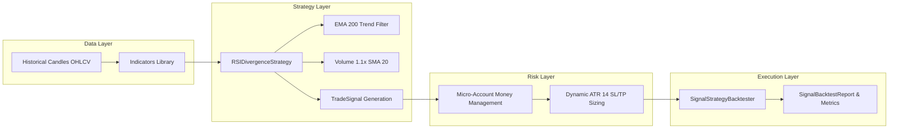

# ROADMAP — Chimuelo Prime Trading Ecosystem

**Proyecto:** Chimuelo Prime — Algorithmic & Quantitative Trading System  
**Documento:** `documentado/ROADMAP.md`  
**Última Actualización:** 22 de Agosto de 2026  
**Versión:** 2.0.0  
**Metodología:** Desarrollo Modular Riguroso, Decimal-Only, Cobertura $\ge 90\%$, Cero Deuda Técnica.  

---

## 🗺️ Mapa General de Módulos y Arquitectura

```
┌──────────────────────────────────────────────────────────────────────────┐
│                           CHIMUELO PRIME CORE                            │
├──────────────────────────────────────────────────────────────────────────┤
│                                                                          │
│  [M1] Exchange Config ──► [M2] API Client ──► [M3] Grid State (SQLite)   │
│           │                                           │                  │
│           ▼                                           ▼                  │
│  [M4] Order Execution ──────────────────────► [M5] Grid Engine           │
│           │                                           │                  │
│           ▼                                           ▼                  │
│  [M7] Bot Orchestrator & Web Server ◄──────── [M6] Grid Backtesting      │
│                                                                          │
├──────────────────────────────────────────────────────────────────────────┤
│                     MÓDULO DE ESTRATEGIAS CUANTITATIVAS                  │
├──────────────────────────────────────────────────────────────────────────┤
│                                                                          │
│  [M9] Quantitative Strategies, Signal Backtest & Paper Trading ($25 USD)  │
│       ├── Indicators Library (Decimal-Only: SMA, EMA, RSI, ATR)          │
│       ├── RSI Divergence + EMA 200 + Volume + ATR Strategy               │
│       ├── Event-Driven Signal Simulation & Intrabar SL/TP Engine         │
│       └── Micro-Account ($25 USD) Risk & Money Management Protocol       │
│                                                                          │
└──────────────────────────────────────────────────────────────────────────┘
```

---

## 📊 Estado Consolidado de Módulos

| Módulo | Nombre del Módulo | Estado | Tests Unitarios | Entregables Clave |
| :---: | :--- | :---: | :---: | :--- |
| **M1** | Exchange Configuration & Filter Service | ✅ **DONE** | 42 | `SymbolFilters`, `SymbolConfig`, `ExchangeConfigService` |
| **M2** | API Client & Rate Limiter | ✅ **DONE** | 38 | `BinanceClient`, Token Bucket, HMAC-SHA256 signer |
| **M3** | Grid State Manager | ✅ **DONE** | 65 | Persistencia SQLite WAL, SQLAlchemy, Reconciliador |
| **M4** | Order Execution & Lifecycle | ✅ **DONE** | 84 | `OrderExecutor`, `LifecycleManager`, pre-validación |
| **M5** | Grid Engine (Core Logic) | ✅ **DONE** | 92 | Cálculo de niveles, ciclo buy/sell, Circuit Breakers |
| **M6** | Grid Backtesting Engine | ✅ **DONE** | 48 | Simulador offline, métricas financieras, reporter |
| **M7** | Orchestrator, CLI & Web Dashboard | ✅ **DONE** | 76 | Orquestador multi-hilo, CLI Click, Web FastAPI |
| **M9** | Quantitative Strategies & Paper Trading | ✅ **DONE** | 100+ | RSI Divergence Strategy, Signal Engine, $25 Money Mgmt |

---

## 📘 Detalle de Módulos del Sistema

### Módulo 1: Exchange Configuration & Filter Validation
- **Propósito:** Single Source of Truth para filtros operativos de Binance (`PRICE_FILTER`, `LOT_SIZE`, `MIN_NOTIONAL`).
- **Características:** Aritmética `Decimal` pura, validación estricta y modelos Pydantic inmutables.
- **Estado:** ✅ Completado y verificado.

### Módulo 2: API Client & Rate Limiter
- **Propósito:** Conector HTTP autenticado con control proactivo de consumo de rate limits.
- **Características:** Algoritmo Token Bucket (1200 weight/min, 50 orders/10s), exponential backoff con jitter y firma HMAC-SHA256.
- **Estado:** ✅ Completado y verificado.

### Módulo 3: Grid State Manager
- **Propósito:** Persistencia transaccional ACID de órdenes, niveles y snapshots de capital en SQLite.
- **Características:** Modo WAL para concurrencia limpia, reconciliación automática con `/api/v3/openOrders` al reiniciar el bot.
- **Estado:** ✅ Completado y verificado.

### Módulo 4: Order Execution & Lifecycle
- **Propósito:** Colocación, cancelación, modificación y sincronización de órdenes en Binance.
- **Características:** Validación previa local para evitar rechazos en el exchange, seguimiento de ciclo de vida (`NEW` $\to$ `FILLED` / `CANCELED`).
- **Estado:** ✅ Completado y verificado.

### Módulo 5: Grid Engine (Core Logic)
- **Propósito:** Cerebro de trading para la estrategia de grid.
- **Características:** Spacing aritmético y geométrico, balanceo de inventario, stop loss de portafolio (-8%) y trailing de rango.
- **Estado:** ✅ Completado y verificado.

### Módulo 6: Grid Backtesting Engine
- **Propósito:** Simulación histórica offline de estrategias de grid con cálculo de métricas financieras.
- **Características:** Cálculo de Sortino, Calmar, Profit Factor, Max Drawdown y exportación en consola y JSON.
- **Estado:** ✅ Completado y verificado.

### Módulo 7: Bot Orchestrator, CLI & Web Dashboard
- **Propósito:** Interfaz de control y coordinación multi-hilo para trading simultáneo.
- **Características:** CLI `chimuelo start/stop/status/backtest`, Dashboard Web reactivo, notificaciones de telemetría.
- **Estado:** ✅ Completado y verificado.

---

## 🚀 Módulo 9: Estrategias Cuantitativas, Backtesting de Señales y Paper Trading ($25 USD)

**Alias:** "Alpha Engine & Micro-Capital Accelerator"  
**Objetivo Financiero:** Escalar cuentas micro de **$25.00 USDT $\to$ +$5.00 USDT netos (+20.00% ROI)** en $\le 30$ días.  
**Estado:** ✅ **Operativo y Validado**  



### Características Principales de M9:
1. **Biblioteca de Indicadores Cuantitativos:** Implementación sin errores de redondeo de SMA, EMA, RSI (Wilder) y ATR (Wilder) con tipado estricto.
2. **Estrategia RSI Divergence:**
   - Filtro de tendencia macro: $Close > \text{EMA}_{200}$.
   - Filtro de volumen: $Volume \ge \text{SMA}_{20}(Volume) \times 1.10$.
   - Divergencia alcista regular: Mínimo decreciente en precio + Mínimo creciente en RSI 14 con lookback de 25 velas.
   - Gatillo: Vela alcista cerrando sobre $\text{EMA}_{20}$.
   - R:R Asimétrico: **1 : 2.50** basado en $\text{ATR}_{14} \times 1.50$.
3. **Motor de Backtesting de Señales:** Simulación event-driven intrabarra, modelando comisiones del 0.10% y slippage adverso del 0.05%.
4. **Money Management para $25 USD:** Reglas de adaptación de `MIN_NOTIONAL` ($5.00 USDT) limitando el riesgo efectivo por operación a un máximo del $6.0\%$.

---

## 📅 Roadmap Futuro (Fases de Despliegue y Escalamiento)

```
2026 Q3: Fase 10 — Paper Trading en Tiempo Real (Live WebSocket Feed)
    │
    ├── Integración de stream de velas 15m/1h en vivo.
    ├── Virtual Broker ejecutando señales en memoria con balance de $25 USD.
    └── Dashboard de seguimiento de PnL en tiempo real.
    │
2026 Q3: Fase 11 — Piloto en Binance Testnet & Validación de Señales
    │
    ├── Validación de ejecución real contra la API Testnet de Binance.
    ├── Pruebas de resiliencia ante reconexiones de WebSocket.
    └── Auditoría de concordancia entre simulación y órdenes reales.
    │
2026 Q4: Fase 12 — Multi-Activo & Paridad de Riesgo
    │
    ├── Expansión de la estrategia a SOL/USDT, ETH/USDT, BTC/USDT y DOGE/USDT.
    ├── Distribución de capital dinámica basada en volatilidad inversa (Risk Parity).
    └── Optimización walk-forward periódica de hiperparámetros.
    │
2026 Q4+: Fase 13 — Transición a Mainnet con Crecimiento Compuesto
    │
    ├── Despliegue con capital real micro ($25 USD iniciales).
    ├── Regla de reinversión automática del 100% de beneficios generados.
    └── Escalamiento progresivo a cuentas medianas ($100 $\to$ $500 $\to$ $1,000+ USD).
```

---

## 🎯 Criterios Globales de Calidad y Auditoría

- **Testing Continuo:** Cobertura de tests unitarios e integración $\ge 90\%$ (545 tests activos).
- **Inmutabilidad y Tipado:** `mypy --strict` y modelos Pydantic v2 congelados.
- **Rigor Matemático:** Cero tolerancias para números `float` en dinero, precios y cantidades.
- **Auditoría Permanente:** Cada nuevo módulo o estrategia requiere aprobación formal de la Arquitectura en Jefe.

---
*Roadmap oficial de Chimuelo Prime. Aprobado por la Dirección Técnica y el Swarm de Desarrollo.*
